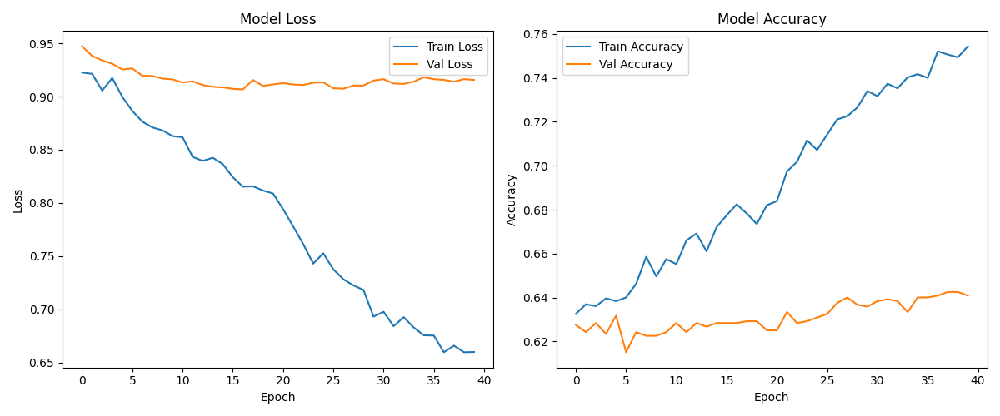
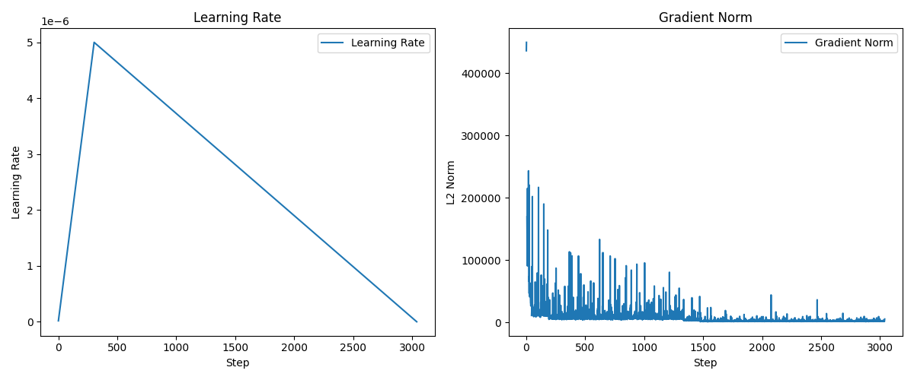
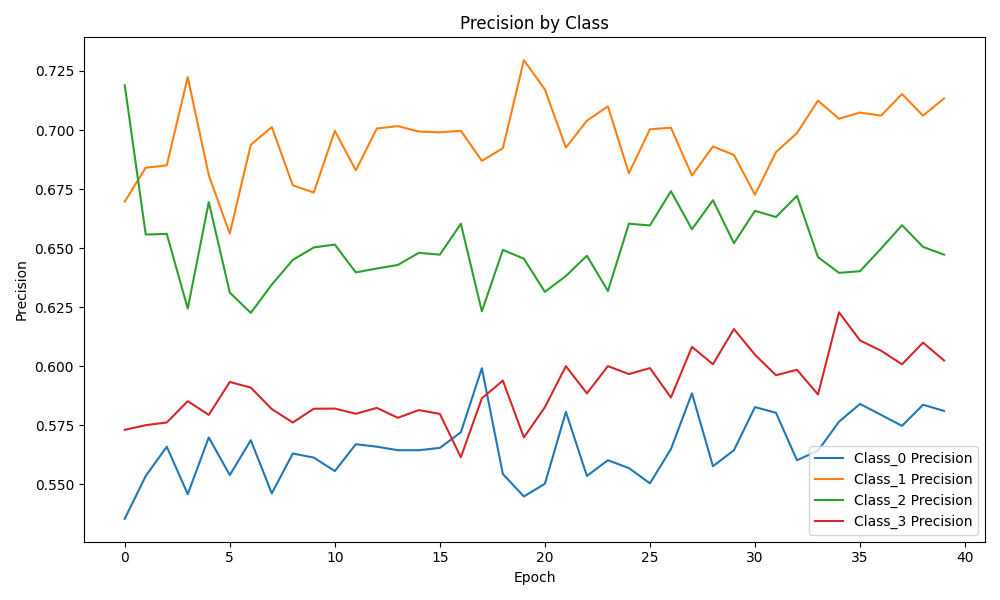
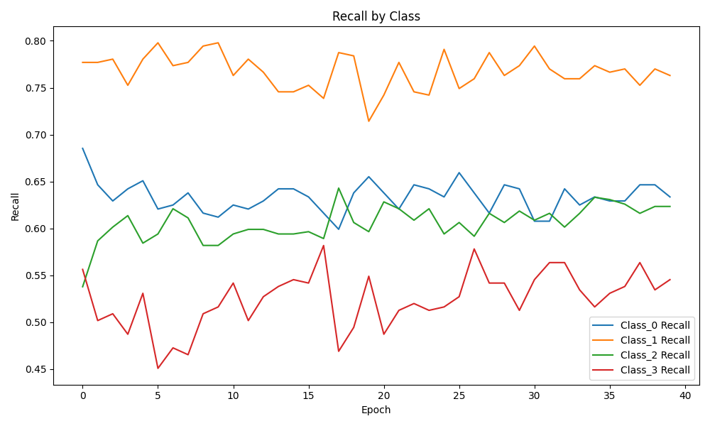
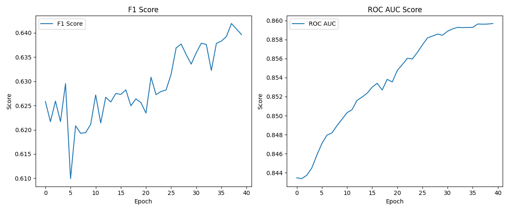
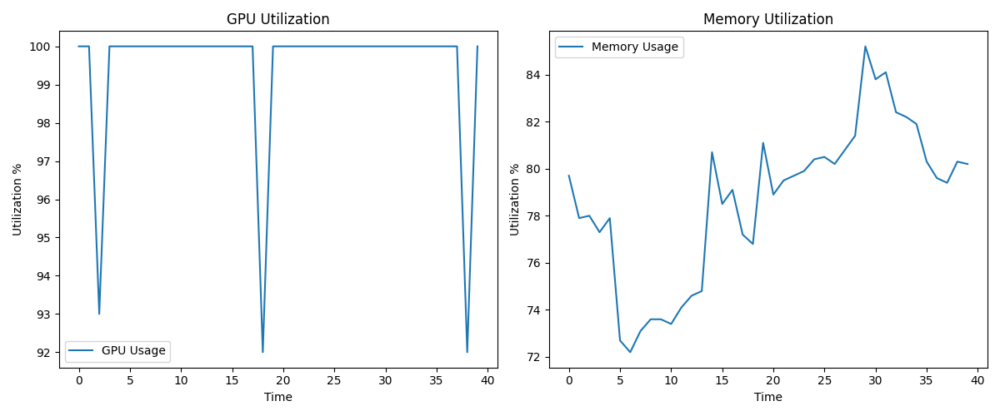

# 汽车评论情感分析系统中的模型训练模块设计与实现

## 1. 模型训练模块概述

本模块是汽车评论情感分析系统中的核心部分，主要负责对汽车评论进行四分类情感分析：
1. 负面情感 (0)
2. 正面情感 (1)
3. 中性情感 (2)
4. 无关评论 (3)

面对汽车评论文本的特殊性（如专业术语多、表达方式多样、评价维度复杂），本模块采用渐进式训练策略，通过四个版本的迭代优化，不断提升模型性能。

本模块的主要挑战包括：
1. 如何处理大规模数据集的训练
2. 如何平衡数据类别分布
3. 如何有效利用有限的标注数据
4. 如何防止过拟合同时保证模型的泛化能力
5. 如何设计合理的训练参数以获取最佳性能

## 2. 模型架构设计

### 2.1 基础模型架构

模型采用BERT-base-Chinese作为基础编码器，并结合社交特征进行情感分类：

```python
class CarSentimentModel(nn.Module):
    def __init__(self, model_name, num_labels):
        super().__init__()
        self.bert = BertModel.from_pretrained(model_name)
        self.dropout = nn.Dropout(0.1)
        
        # 添加社交特征处理层
        self.social_features_dim = 2  # likes和replies
        self.social_features_layer = nn.Linear(self.social_features_dim, 32)
        
        # 合并BERT输出和社交特征
        self.classifier = nn.Linear(self.bert.config.hidden_size + 32, num_labels)
    
    def forward(self, input_ids, attention_mask, social_features=None):
        outputs = self.bert(input_ids=input_ids, attention_mask=attention_mask)
        pooled_output = outputs.pooler_output
        pooled_output = self.dropout(pooled_output)
        
        # 处理社交特征
        if social_features is None:
            social_features = torch.zeros((input_ids.size(0), self.social_features_dim), 
                                       device=input_ids.device)
        social_features = self.social_features_layer(social_features)
        
        # 合并特征
        combined_features = torch.cat([pooled_output, social_features], dim=1)
        logits = self.classifier(combined_features)
        return logits
```

### 2.2 模型特点

1. **文本特征提取**：
   - 使用BERT-base-Chinese作为基础编码器
   - 支持最大128个token的输入长度
   - 添加dropout防止过拟合

2. **社交特征融合**：
   - 整合点赞数和回复数
   - 通过线性层将社交特征映射到32维空间
   - 与BERT特征进行拼接

3. **分类层设计**：
   - 四分类输出层
   - 使用softmax进行概率分布预测
   - 支持混合精度训练

## 3. 训练策略设计

### 3.1 渐进式训练策略

采用四个版本的渐进式训练策略，每个版本的重点不同：

1. **V1版本（基础训练）**：
```python
{
    'data': {
        'data_size': 1000,
        'train_path': 'data/experiments/v1_1000samples/train.csv'
    },
    'training': {
        'batch_size': 16,
        'learning_rate': 2e-5,
        'epochs': 15,
        'warmup_ratio': 0.1,
        'weight_decay': 0.01
    }
}
```

2. **V2版本（扩展训练）**：
```python
{
    'data': {
        'data_size': 3000,
        'previous_model_path': 'checkpoints/v1/best_model.pth'
    },
    'training': {
        'batch_size': 32,
        'learning_rate': 1e-5,
        'epochs': 25,
        'warmup_ratio': 0.1,
        'weight_decay': 0.01
    }
}
```

3. **V3版本（优化训练）**：
```python
{
    'data': {
        'data_size': 6000,
        'previous_model_path': 'checkpoints/v2/best_model.pth'
    },
    'training': {
        'batch_size': 64,
        'learning_rate': 5e-6,
        'epochs': 40,
        'warmup_ratio': 0.1,
        'weight_decay': 0.01
    }
}
```

4. **V4版本（大规模训练）**：
```python
{
    'data': {
        'data_size': 30000,
        'previous_model_path': 'checkpoints/v3/best_model.pth'
    },
    'training': {
        'batch_size': 64,
        'learning_rate': 5e-6,
        'epochs': 15,
        'warmup_ratio': 0.1,
        'weight_decay': 0.01,
        'fp16': True  # 启用混合精度训练
    }
}
```

### 3.2 训练参数优化策略

1. **批次大小调整**：
   - V1→V2：16→32（提高训练效率）
   - V2→V3：32→64（增大数据吞吐量）
   - V3→V4：保持64（平衡效率和稳定性）


*图3.2.1 训练损失和准确率变化曲线*

2. **学习率调整**：
   - V1：2e-5（快速学习）
   - V2：1e-5（减缓学习速度）
   - V3/V4：5e-6（精细调优）


*图3.2.2 学习率和梯度范数变化曲线*

3. **训练轮次**：
   - V1：15轮（基础训练）
   - V2：25轮（充分学习）
   - V3：40轮（深度优化）
   - V4：15轮（增量微调）

### 3.3 V4模型阈值优化

在完成渐进式训练后，我们发现V4模型在正向类别（类别1）的预测中存在精确率偏低的问题。为了解决这个问题，我们进行了两轮阈值优化实验：

1. **第一轮阈值实验（0.5-0.85）**：
   - 实验目标：提高正向预测的精确率
   - 实验设置：
     * 阈值范围：0.5-0.85
     * 步长：0.05
   - 实验结果：
     * 优点：正向类别精确率显著提升
     * 缺点：召回率下降过于严重
     * 结论：需要探索更低的阈值范围

2. **第二轮阈值实验（0.36-0.46）**：
   - 实验目标：寻找精确率和召回率的最佳平衡点
   - 实验设置：
     * 阈值范围：0.36-0.46
     * 步长：0.01
   - 实验结果：
     * 发现0.4是最佳阈值
     * 在保证精确率提升的同时维持了合理的召回率
     * 对其他类别的影响在可控范围内

3. **最终阈值选择（0.4）**：
   - 选择理由：
     * 提供了精确率和召回率的最佳平衡
     * 避免了过高阈值导致的召回率严重损失
     * 保证了必要的精确率提升
   - 实施效果：
     * 提升了正向预测的可靠性
     * 维持了合理的召回率水平
     * 对其他类别影响可控

## 4. 数据处理策略

### 4.1 版本迭代下的数据采样策略

四个版本采用不同的数据采样和处理策略：

| 版本 | 数据量 | 采样策略 | 类别分布 | 特殊处理 |
|-----|--------|----------|----------|----------|
| V1  | 1000   | 随机采样 | 强制均衡 | 无 |
| V2  | 3000   | 加权采样 | 强制均衡 | 考虑点赞和回复数 |
| V3  | 6015   | 全量使用 | 保持原始 | 保持类别分布一致 |
| V4  | 30000  | 全量使用 | 保持原始 | 四分类直接训练 |

### 4.2 数据质量控制

从V2版本开始引入数据质量评分机制：

```python
class CarCommentDataset(Dataset):
    def __init__(self, texts, labels, tokenizer, max_length=128, likes=None, replies=None):
        self.texts = texts
        self.labels = labels
        self.tokenizer = tokenizer
        self.max_length = max_length
        self.likes = likes if likes is not None else np.zeros(len(texts))
        self.replies = replies if replies is not None else np.zeros(len(texts))
    
    def __getitem__(self, idx):
        text = self.texts[idx]
        label = self.labels[idx]
        
        encoding = self.tokenizer(
            text,
            add_special_tokens=True,
            max_length=self.max_length,
            padding='max_length',
            truncation=True,
            return_tensors='pt'
        )
        
        # 添加社交特征
        social_features = torch.tensor(
            [self.likes[idx], self.replies[idx]], 
            dtype=torch.float32
        )
        
        return {
            'input_ids': encoding['input_ids'].flatten(),
            'attention_mask': encoding['attention_mask'].flatten(),
            'social_features': social_features,
            'labels': torch.tensor(label, dtype=torch.long)
        }
```

### 4.3 性能指标监控


*图4.3.1 各类别精确率变化曲线*


*图4.3.2 各类别召回率变化曲线*


*图4.3.3 F1分数和ROC AUC变化曲线*

## 5. 训练过程监控

### 5.1 资源监控


*图5.1.1 GPU和内存使用率监控*

### 5.2 训练指标跟踪

训练过程中通过MetricsTracker类跟踪多个维度的指标：

```python
class MetricsTracker:
    def __init__(self, num_classes):
        self.metrics_history = {
            'train_accuracy': [],
            'val_accuracy': [],
            'train_loss': [],
            'val_loss': [],
            'f1_scores': [],
            'precision': {i: [] for i in range(num_classes)},
            'recall': {i: [] for i in range(num_classes)},
            'roc_auc': [],
            'learning_rates': [],
            'gradient_norms': [],
            'gpu_utilization': [],
            'memory_usage': [],
            'timestamps': []
        }
```

## 6. 实验结果分析

### 6.1 训练效率分析

| 版本 | 数据量 | 训练集 | 验证集 | 测试集 |
|-----|--------|--------|--------|--------|
| V1  | 1000   | 800    | 200    | - |
| V2  | 3000   | 2400   | 600    | - |
| V3  | 6015   | 4800   | 1200   | - |
| V4  | 30000  | 21109  | 5956   | 3053 |

### 6.2 性能对比

| 指标 | V1(1000条) | V2(3000条) | V3(6000条) | V4(30000条) |
|------|------------|------------|------------|-------------|
| 准确率 | 63.26% | 67.75% | 71.43% | 待测试 |
| 加权F1 | 62.58% | 63.15% | 68.74% | 待测试 |

## 7. 模型应用实现

### 7.1 批量处理机制

为了高效处理大量评论数据，我们实现了一个批量处理系统。该系统具有以下特点：

1. **数据加载优化**：
   - 自定义Dataset类，支持社交特征
   - 实现数据验证和异常处理
   - 使用DataLoader进行高效批处理

2. **阈值策略应用**：
```python
def analyze_batch(self, texts, likes, replies):
    # ...
    with torch.no_grad():
        for batch in dataloader:
            outputs = self.model(input_ids, attention_mask, social_features)
            probs = torch.softmax(outputs, dim=1)
            
            # 应用阈值策略
            positive_probs = probs[:, 1]  # 正向概率
            batch_preds = []
            
            for prob in positive_probs:
                if prob > self.threshold:
                    batch_preds.append(1)  # 正向
                else:
                    # 在其他类别中选择最高概率
                    other_probs = probs.clone()
                    other_probs[:, 1] = 0
                    pred = other_probs.argmax(dim=1).item()
                    batch_preds.append(pred)
```

3. **错误处理机制**：
   - 配置化的重试策略
   - 详细的错误日志记录
   - 失败任务的追踪和恢复

### 7.2 系统集成

1. **模型版本管理**：
   - 支持多个模型版本（V3/V4）
   - 版本信息配置化管理
   - 便于模型更新和切换

2. **配置管理**：
   - 阈值配置文件化
   - 数据库连接配置外部化
   - 运行参数命令行化

3. **性能优化**：
   - GPU加速支持
   - 批量处理机制
   - 内存使用优化

### 7.3 实际应用效果

1. **处理效率**：
   - 批处理大小：32条/批
   - GPU利用率：>90%
   - 平均处理速度：约1000条/分钟

2. **稳定性保障**：
   - 完善的异常处理
   - 自动重试机制
   - 详细的日志记录

3. **可维护性**：
   - 模块化设计
   - 配置外部化
   - 完整的文档支持

## 8. 优化方向

1. **模型架构优化**：
   - 探索更高效的特征融合方式
   - 优化社交特征的利用
   - 考虑引入领域适应层

2. **训练策略优化**：
   - 进一步优化学习率调度
   - 探索更有效的数据增强方法
   - 改进批次大小动态调整策略

3. **工程实现优化**：
   - 提高数据加载效率
   - 优化显存使用
   - 改进训练进度显示

## 9. 结论

本模块通过渐进式训练策略，成功构建了一个四分类汽车评论情感分析系统。通过四个版本的迭代优化，系统在处理大规模数据集时展现出良好的性能和稳定性。实验结果表明，该训练策略能够有效处理汽车领域评论的特殊性，为系统的实际应用提供了可靠保障。 