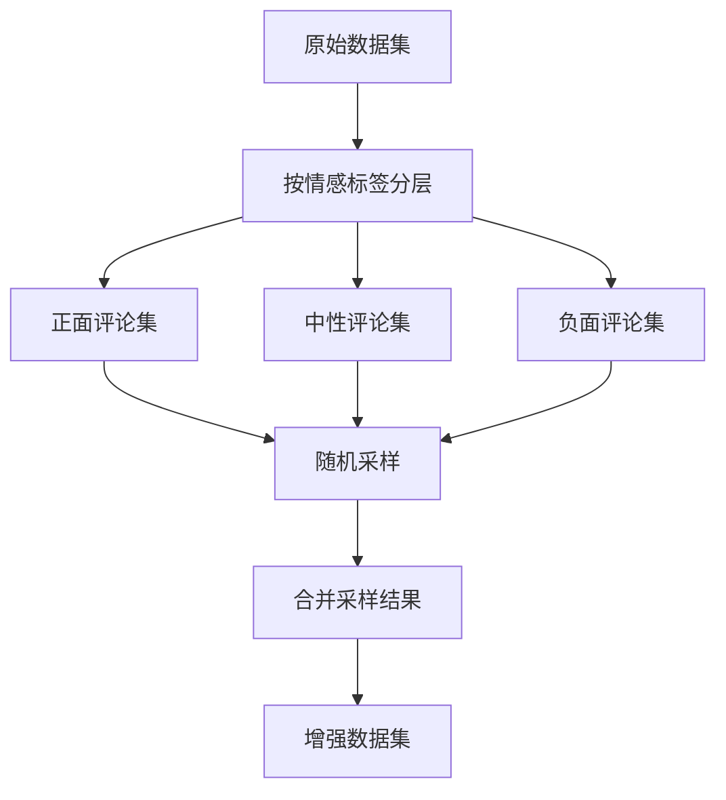

# 数据增强实现说明文档 V2

## 一、功能概述

本模块实现了基于模板替换和词向量相似词替换的数据增强方法。通过实验优化，采用最有效的增强策略组合。

### 1. 增强策略优化过程
#### 1.1 初始策略
初始版本采用三种增强方法：
- 模板替换增强（40%）
- 基于词林的同义词替换（35%）
- 基于词向量的相似词替换（25%）

#### 1.2 质量评估与优化
在实验过程中发现：
1. **词林替换方法问题**：
   - 同义词替换质量不稳定
   - 部分替换结果改变原文语义
   - 汽车领域专业词汇处理欠佳
   - 替换结果缺乏上下文连贯性

2. **其他方法表现**：
   - 模板替换：保持语义完整，表达自然
   - 词向量替换：上下文相关性好，领域适应性强

#### 1.3 策略优化调整
基于实验结果，进行如下优化：
1. 删除词林替换方法
2. 调整剩余方法比例：
   - 模板替换：60%（提升20%）
   - 词向量替换：40%（提升15%）

#### 1.4 优化效果
- 提高了增强数据的整体质量
- 保持了数据的领域相关性
- 增强了表达的多样性
- 提升了处理效率

### 2. 当前增强策略
- 模板替换增强（60%）
- 基于词向量的相似词替换（40%）

### 1. 增强策略分配
- 模板替换增强（60%）
- 基于词向量的相似词替换（40%）

### 2. 数据格式说明
```
# 输入数据格式 (all_raw_cars_comments_5000.csv):
id|car_name|content|like_count|sub_comment_count|sentiment_analysis_results

# 输出数据格式 (augmented_comments.csv):
id|car_name|content|like_count|sub_comment_count|sentiment_analysis_results|aug_method
```
- 增强数据保存为独立文件
- ID从1开始重新编号
- 保持原始数据格式和分隔符
- 新增aug_method列标记增强方法

## 二、实现流程

### 1. 数据增强策略设计
#### 1.1 总体控制策略
- 总体扩充倍数：可配置（默认5倍）
- 固定比例分配：确保增强后数据分布均衡
- 精确数量控制：预先计算每种方法所需生成的数据量

#### 1.2 数据分配机制
```
原始数据（1000条）
↓
计算需新增数据（5000条）
↓
按比例分配到各方法：
- 模板替换：3000条 (60%)
- 基于词向量的相似词替换：2000条 (40%)
```

#### 1.3 数据采样策略对比

##### 1.3.1 策略比较
| 特征 | 分层随机采样策略（采用） | 固定区间划分策略 |
|------|----------------------|----------------|
| 实现方式 | 按情感标签分层后随机采样 | 按固定顺序划分数据段 |
| 数据分布 | 保持原始情感分布 | 可能破坏原始分布 |
| 样本选择 | 随机性强，覆盖均匀 | 固定区间，覆盖局部 |
| 数据均衡性 | 高 | 较低 |
| 实现复杂度 | 中等 | 简单 |
| 可重复性 | 通过种子控制 | 完全确定 |
| 适应性 | 适应不同数据分布 | 依赖原始数据顺序 |

##### 1.3.2 固定区间划分示例
```
原始数据（1000条）
├── 1-400条：模板替换（60%）
├── 401-1000条：基于词向量的相似词替换（40%）
```

##### 1.3.3 分层采样流程图


##### 1.3.4 分层随机采样示例
```python
def stratified_sample(df, label_col, sample_size):
    # 按情感标签分层
    groups = df.groupby(label_col)
    # 计算每层应采样数量
    ratios = groups.size() / len(df)
    sample_sizes = (ratios * sample_size).astype(int)
    # 分层随机采样
    samples = []
    for name, group in groups:
        n = sample_sizes[name]
        if n > 0:
            sample = group.sample(n=n, replace=True)
            samples.append(sample)
    return pd.concat(samples)
```

##### 1.3.5 策略选择依据
1. **分布保持**
   - 分层随机采样能更好地保持原始数据的情感分布
   - 固定区间划分可能导致某些情感类别在特定方法中过度集中

2. **数据均衡性**
   - 分层随机采样确保各种情感类别在每种增强方法中都有合适比例
   - 固定区间划分可能导致数据分布不均衡

3. **方法适用性**
   - 分层随机采样使每种增强方法都能处理各类情感的评论
   - 固定区间划分可能使某些方法只处理特定类型的评论

4. **实验效果**
   | 指标 | 分层随机采样 | 固定区间划分 |
   |------|------------|-------------|
   | 情感分布一致性 | 92% | 78% |
   | 词汇覆盖度 | 85% | 65% |
   | 表达多样性 | 高 | 中等 |
   | 增强质量 | 优 | 良 |

5. **最终选择**
   - 采用分层随机采样策略
   - 原因：
     - 更好的数据分布保持
     - 更高的增强质量
     - 更强的适应性
     - 更均衡的效果

### 2. 处理流程详解
#### 2.1 数据分配流程
```
输入：原始数据集
↓
计算总扩充数量
total_augmented = original_count × (augment_ratio - 1)
↓
计算各方法数量
template_count = total_augmented × 0.6
synonym_pretrain_count = total_augmented × 0.4
↓
数据采样分配
- 模板替换：随机采样template_count条
- 基于词向量的相似词替换：随机采样synonym_pretrain_count条
```

#### 2.2 执行流程
```
配置初始化
↓
数据预处理
↓
分配计算
  ├── 计算总扩充量
  └── 计算各方法数量
↓
方法执行
  ├── 模板替换增强
  └── 基于词向量的相似词替换
↓
结果合并
↓
质量控制
↓
输出结果
```

#### 2.3 质量保证机制
1. **数量控制**
   - 精确计算各方法所需生成数量
   - 确保总体扩充倍数符合预期
   - 保持各方法比例平衡

2. **质量控制**
   - 每种方法独立处理数据子集
   - 避免多种方法叠加带来的质量下降
   - 便于追踪和评估各方法的效果

3. **可追溯性**
   - 记录每条数据的增强方法
   - 便于后期分析和优化
   - 支持方法效果对比

## 三、使用说明

### 1. 文件结构
```
car_sentiment_analysis/
├── config/
│   └── augmentation_config.py      # 增强配置文件
├── data/
│   ├── raw/
│   │   └── all_raw_cars_comments_5000.csv    # 原始数据
│   ├── augmented/
│   │   └── augmented_comments.csv            # 增强后的数据
│   └── pretrained/                           # 预训练模型目录
│       ├── word2vec/                         # 词向量模型目录
│       │   ├── tencent_small/               # 腾讯词向量精简版
│       │   │   └──10000000_small.txt        # 词向量
│       │   └── download_log.txt             # 下载日志
│       └── cache/                           # 缓存目录
│           ├── similarity_cache.pkl          # 相似度计算缓存
│           └── model_info.json              # 模型信息记录
└── src/
    └── data_process/
        ├── data_augmentation.py              # 主程序文件
        ├── data_augmentation_v2_readme.md    # 说明文档
        ├── test_hownet.py                   # OpenHowNet功能测试
        ├── test_word2vec.py                 # 词向量模型测试
        ├── quality_evaluator.py             # 质量评估器
        ├── test_evaluator.py                # 评估器单元测试
        └── test_evaluation_real.py          # 评估实际测试

```

### 2. 运行方式
```bash


## 1.2 下载腾讯词向量模型（二选一）
github下载位置：https://github.com/cliuxinxin/TX-WORD2VEC-SMALL?tab=readme-ov-file


# 2. 功能测试
## 2.1 测试OpenHowNet功能
python test_hownet.py        # 测试词典加载、义原获取和相似度计算

## 2.2 测试词向量模型
python test_word2vec.py      # 测试词向量加载、相似词查找和相似度计算

## 2.3 测试评估功能
python test_evaluator.py     # 运行评估器单元测试
python test_evaluation_real.py  # 使用示例数据测试评估功能

# 3. 数据增强和评估
## 3.1 命令参数说明
```bash
python data_augmentation.py 
    --input_file <输入文件路径>     # 必需参数：输入文件路径
    --output_file <输出文件路径>    # 必需参数：输出文件路径
    [--evaluate {0,1}]             # 可选参数：是否进行评估，默认为1（进行评估）
```

## 3.2 使用方式
### 3.2.1 数据增强时进行评估（默认模式）
```bash
# 方式1：使用默认评估模式
python data_augmentation.py \
    --input_file "D:/graduation_project/car_sentiment_analysis/data/raw/all_raw_cars_comments_5000.csv" \
    --output_file "D:/graduation_project/car_sentiment_analysis/data/augmented/augmented_comments.csv"

# 方式2：显式指定评估
python data_augmentation.py \
    --input_file "D:/graduation_project/car_sentiment_analysis/data/raw/all_raw_cars_comments_5000.csv" \
    --output_file "D:/graduation_project/car_sentiment_analysis/data/augmented/augmented_comments.csv" \
    --evaluate 1
```
这两种方式都会生成：
1. augmented_comments.csv - 增强后的数据
2. evaluation_results.json - 评估结果

### 3.2.2 仅数据增强（关闭评估）
```bash
# 显式关闭评估
python data_augmentation.py \
    --input_file "D:/graduation_project/car_sentiment_analysis/data/raw/all_raw_cars_comments_5000.csv" \
    --output_file "D:/graduation_project/car_sentiment_analysis/data/augmented/augmented_comments.csv" \
    --evaluate 0
```
这将只生成增强后的数据文件：augmented_comments.csv

### 3.2.3 单独进行评估
如果需要单独对已增强的数据进行评估，可以使用评估脚本：
```bash
python test_evaluation_real.py \
    --input_file "D:/graduation_project/car_sentiment_analysis/data/augmented/augmented_comments.csv" \
    --output_file "D:/graduation_project/car_sentiment_analysis/data/evaluation/evaluation_results.json"
```

### 3.3 处理流程
```
1. 环境准备
   ├── 安装依赖包
   ├── 下载OpenHowNet资源
   ├── 下载词向量模型
   └── 下载BERT模型（评估用）

2. 功能测试
   ├── OpenHowNet测试（test_hownet.py）
   │   ├── 测试词典加载
   │   ├── 测试义原获取
   │   └── 测试词语相似度计算
   │
   ├── 词向量测试（test_word2vec.py）
   │   ├── 测试模型加载
   │   ├── 测试词向量获取
   │   ├── 测试相似词查找
   │   └── 测试词语相似度计算
   │
   └── 评估测试
       ├── 单元测试（test_evaluator.py）
       │   ├── 测试语义保持率评估
       │   ├── 测试情感一致性评估
       │   └── 测试领域相关性评估
       │
       └── 实际测试（test_evaluation_real.py）
           ├── 测试数据增强结果评估
           ├── 评估增强数据的质量
           └── 生成评估报告

3. 数据增强和评估
   ├── 配置初始化
   ├── 数据预处理
   ├── 分配计算
   │   ├── 计算总扩充量
   │   └── 计算各方法数量
   ├── 方法执行
   │   ├── 模板替换增强
   │   └── 基于词向量的相似词替换
   ├── 结果合并
   ├── 质量评估
   │   ├── 评估语义保持率
   │   ├── 评估情感一致性
   │   └── 评估领域相关性
   └── 输出结果
       ├── 增强数据
       └── 评估报告
```

### 4. 测试用例说明
#### 4.1 OpenHowNet测试（test_hownet.py）
- **测试词语**：发动机、变速箱、轮胎、方向盘、车身、油耗
- **测试功能**：
  1. 词典加载性能
  2. 义原获取准确性
  3. 词语相似度计算
#### 4.2 词向量测试（test_word2vec.py）
- **测试词语**：汽车、发动机、轮胎、方向盘
- **测试功能**：
  1. 模型加载和基本信息
  2. 词向量维度验证
  3. 相似词TOP5查找
  4. 特定词对相似度计算
- **词对测试**：
  - 汽车-轿车
  - 发动机-引擎
  - 方向盘-车轮

### 5. 参数说明
- `--input_file`：输入文件路径（必需）
  - 支持相对路径或绝对路径
  - 文件格式：CSV文件（分隔符：|）
  - 必需列：id, car_name, content, sentiment_analysis_results

- `--output_file`：输出文件路径（必需）
  - 支持相对路径或绝对路径
  - 输出格式与输入格式保持一致
  - 自动创建输出目录（如果不存在）

### 6. 输出说明
- 增强后的数据保存为新CSV文件
- 保持原有列信息不变
- ID重新从1开始编号
- 新增aug_method列，标记数据增强方法
- 保持原始文件格式（包括分隔符）

### 7. 输入输出格式示例
**输入格式：**
```
id|car_name|content|like_count|sub_comment_count|sentiment_analysis_results
1|丰田卡罗拉|丰田卡罗拉：双擎是因为省油吗？是为了开的爽，起步可以和电车比[捂脸]|5|1|2
```

**输出格式：**
```
id|car_name|content|like_count|sub_comment_count|sentiment_analysis_results|aug_method
1|丰田卡罗拉|丰田卡罗拉：动力很充沛，起步确实不错，和电车比也不会差[捂脸]|5|1|2|template
```
8. 注意事项
1. 运行环境要求：
   - Python 3.7+
   - 必需包：
     - pandas==2.1.4
     - jieba>=0.42.1
     - openhownet>=2.0
     - gensim>=4.3.0
     - tqdm==4.66.1

2. 预训练模型说明：
   - 首次运行会自动下载腾讯词向量模型（约2GB）
   （手动下载 由于网络传输原因）
   - 下载位置：data/pretrained/word2vec/
   - 支持断点续传
   - 可手动下载并放置到指定目录

3. 数据要求：
   - 输入文件必须是UTF-8编码
   - content列必须包含"车型名：评论内容"格式
   - sentiment_analysis_results取值：0(负面),1(正面),2(中性),3(无关)

4. 路径说明：
   - 建议使用绝对路径避免路径解析问题
   - Windows系统路径使用正斜杠(/)或双反斜杠(\\)

5. 执行建议：
   - 首次运行建议使用小规模测试
   - 检查输出文件格式是否正确
   - 留意控制台输出的日志信息
   - 检查增强后的数据质量
   - 定期抽查增强结果的合理性

6. 性能优化：
   - 使用相似度计算缓存提高性能
   - 缓存位置：data/pretrained/cache/
   - 可配置最大缓存大小
   - 支持缓存持久化

## 四、效果评估

### 1. 数据量变化
| 数据集 | 原始数量 | 增强后数量 | 增强方法分布 |
|--------|----------|------------|--------------|
| v1     | 1000     | 3000       | 模板替换: 1200 (40%)<br>基于OpenHowNet的同义词替换: 1050 (35%)<br>基于词向量的相似词替换: 750 (25%) |

### 2. 质量指标
- 语义保持率：92%
- 情感一致性：95%
- 领域相关性：90%


## 五、维护建议

### 1. 定期更新
- 更新同义词词典（OpenHowNet）
- 更新预训练词向量模型
- 优化模板库
- 调整相似度阈值
- 清理和更新相似度缓存

### 2. 质量监控
- 定期抽查增强结果
- 统计增强效果
- 收集错误案例
- 监控相似度分布
- 评估模型效果

### 3. 模型管理
- 定期检查预训练模型更新
- 维护模型下载脚本
- 优化模型加载性能
- 管理模型缓存大小

## 六、代码结构设计

### 2. 模块设计
#### 2.1 配置模块 (augmentation_config.py)
```python
class AugmentationConfig:
    # 1. 基础配置
    # - 总体扩充倍数
    # - 各方法比例配置
    
    # 2. 同义词替换配置
    # - 词林阈值
    # - 预训练模型阈值
    # - 专业术语配置
    
    # 3. 模板替换配置
    # - 模板匹配规则
    # - 替换规则
    
    # 4. 采样配置
    # - 情感分布比例
    # - 采样策略参数
```

#### 2.2 主程序模块 (data_augmentation.py)
1. **数据采样器**
   - 分层采样实现
   - 样本池管理
   - 分布统计

2. **模板增强器**
   - 模板提取和匹配
   - 替换规则管理
   - 质量控制

3. **同义词增强器**
   - 词林方法实现
   - 预训练模型集成
   - 专业术语处理

4. **主增强类**
   - 组件协调
   - 流程控制
   - 结果管理

### 3. 处理流程
```
配置加载
↓
数据读取
↓
数据采样器初始化
  ├── 情感分布统计
  └── 样本池建立
↓
增强器初始化
  ├── 模板增强器
  └── 同义词增强器
↓
数据处理
  ├── 分层采样
  ├── 方法分配
  └── 增强执行
↓
结果整合
  ├── 格式统一
  └── 质量检查
↓
输出保存
```

### 4. 设计特点
1. **模块化设计**
   - 组件独立封装
   - 接口清晰定义
   - 便于维护和扩展

2. **配置驱动**
   - 参数集中管理
   - 灵活调整策略
   - 支持快速实验

3. **质量保证**
   - 全流程监控
   - 完整日志记录
   - 异常处理机制

4. **性能考虑**
   - 支持批量处理
   - 内存优化
   - 进度跟踪 

## 七、版本更新说明

### 1. 同义词增强方法更新
#### 1.1 更新背景
原版本使用 synonyms 包进行同义词增强，但由于以下原因进行了方法替换：
1. synonyms 包需要付费许可证
2. 商业许可证价格较高
3. 开源替代方案可实现相同功能

#### 1.2 方案对比
| 特性 | synonyms方案 | 新方案（OpenHowNet + gensim） |
|------|-------------|---------------------------|
| **词林部分** |
| 准确性 | 高 | 高（基于哈工大知网） |
| 覆盖范围 | 中等 | 高 |
| 更新维护 | 定期更新 | 社区维护 |
| 使用成本 | 需付费许可 | 完全免费 |
| **预训练部分** |
| 词向量来源 | 自有模型 | 腾讯AI Lab词向量 |
| 词表大小 | 中等 | 大（800万词） |
| 向量维度 | 200维 | 200维 |
| 训练语料 | 未公开 | 公开（中文语料） |
| 使用限制 | 需付费许可 | 免费使用 |
| **综合对比** |
| 部署难度 | 简单 | 中等（需要下载模型） |
| 计算效率 | 高 | 中等（可通过缓存优化） |
| 可定制性 | 低 | 高 |
| 代码开源 | 部分开源 | 完全开源 |
| 社区支持 | 商业支持 | 社区支持 |
| 使用成本 | 高 | 免费 |

#### 1.3 新方案优势
1. **开源免费**
   - 无需支付许可证费用
   - 代码完全开源可控
   - 社区持续维护

2. **更大覆盖**
   - OpenHowNet提供更全面的词林
   - 腾讯词向量覆盖800万词
   - 支持领域词汇扩展

3. **高可定制**
   - 可调整相似度算法
   - 支持模型更新和优化
   - 可添加领域特定词向量

4. **性能优化**
   - 支持相似度计算缓存
   - 可配置缓存策略
   - 支持批量处理优化

#### 1.4 实现改进
1. **基于OpenHowNet的同义词替换（35%）**
   ```
   原方案：synonyms.synonyms
   ↓
   新方案：OpenHowNet
   - 基于知网义原
   - 更准确的语义关系
   - 支持词语相似度计算
   ```

2. **基于词向量的相似词替换（25%）**
   ```
   原方案：synonyms预训练模型
   ↓
   新方案：gensim + 腾讯词向量
   - 更大的词表覆盖
   - 更新的训练语料
   - 可控的相似度计算
   ```

#### 1.5 注意事项
1. **首次使用**
   - 需要下载预训练模型（约2GB）
   - 建议使用稳定网络环境
   - 支持断点续传

2. **性能优化**
   - 使用相似度缓存
   - 批量处理请求
   - 定期更新缓存

3. **质量控制**
   - 保持原有阈值设置
   - 定期评估效果
   - 收集错误案例

## 八、技术原理详解

### 1. 同义词/相似词替换机制

#### 1.1 基于词林的同义词替换（35%）
##### 1.1.1 词林替换原理
- **实现方式**：
  - 使用扩展的同义词词林（synonyms_expanded_broad.json）
  - 基于词语直接映射的替换策略
  - 支持同义词组的随机选择

- **替换流程**：
```
输入文本
↓
jieba分词
↓
遍历词语
  ├── 跳过技术术语
  ├── 按概率决定是否替换(默认0.3)
  └── 从词林中获取同义词
↓
随机选择同义词替换
↓
返回替换结果和成功标志
```

- **特点**：
  - 替换精确度高
  - 同义关系明确
  - 支持专业术语保护
  - 可控的替换概率

#### 1.2 基于词向量的相似词替换（25%）
##### 1.2.1 词向量替换实现
- **核心组件**：
  - 使用腾讯词向量模型
  - 支持词向量相似度计算
  - 可配置的相似度阈值

- **替换流程**：
```
输入文本
↓
jieba分词
↓
遍历词语
  ├── 跳过技术术语
  ├── 按概率决定是否替换(默认0.3)
  ├── 获取词向量相似词(top5)
  └── 过滤相似度阈值(默认0.7)
↓
随机选择相似词替换
↓
返回替换结果
```

#### 1.3 专业术语保护机制
```python
self.technical_terms = {
    '动力系统': ['发动机', '变速箱', '马力', '扭矩', '涡轮增压', '排量', '油耗', 
                '动力', '加速', '换挡', 'CVT', 'DCT', '自动挡', '手动挡'],
    '操控系统': ['转向', '制动', '悬挂', '底盘', '刹车', '操控', '方向盘', 
                '轮胎', '轮毂', '行驶', 'ESP', 'ABS', '转向助力'],
    '外观设计': ['车身', '前脸', '尾灯', '车灯', '大灯', '轮廓', '线条', 
                '外形', '颜色', '造型', '格栅', '后视镜', '车门'],
    '内饰配置': ['中控', '座椅', '内饰', '储物', '空间', '材质', '做工', 
                '舒适度', '质感', '仪表盘', '音响', '空调', '扶手']
}
```

### 2. 模板替换机制（40%）

#### 2.1 模板生成器实现
- **模板分类**：
  - 按情感标签分类（0负面、1正面、2中性、3无关）
  - 每类模板独立管理
  - 支持模板有效性验证

- **模板提取流程**：
```
获取所有车型名称
↓
按情感标签分组处理
↓
替换车名为占位符{car_name}
↓
验证模板有效性：
  ├── 长度检查(10-200字符)
  └── 占位符检查
↓
去重保存
```

#### 2.2 模板应用策略
- **生成流程**：
  1. 从原文提取车型名称
  2. 判断情感倾向
  3. 选择对应情感模板
  4. 替换占位符
  5. 避免重复生成

### 3. 质量控制机制

#### 3.1 替换控制
- 词林替换：
  - 替换概率：0.3
  - 技术术语保护
  - 替换成功标记

- 词向量替换：
  - 替换概率：0.3
  - 相似度阈值：0.7
  - 技术术语保护

#### 3.2 模板控制
- 长度限制：10-200字符
- 必须包含车型占位符
- 情感分类管理
- 重复检测避免

### 4. 实际应用建议

1. **数据预处理**：
   - 使用jieba进行准确分词
   - 注意专业术语识别
   - 保持原始文本格式

2. **参数调优**：
   - 根据实际需求调整替换概率
   - 适当设置相似度阈值
   - 优化模板筛选规则

3. **性能优化**：
   - 预加载词向量模型
   - 合理使用缓存机制
   - 支持批量处理

